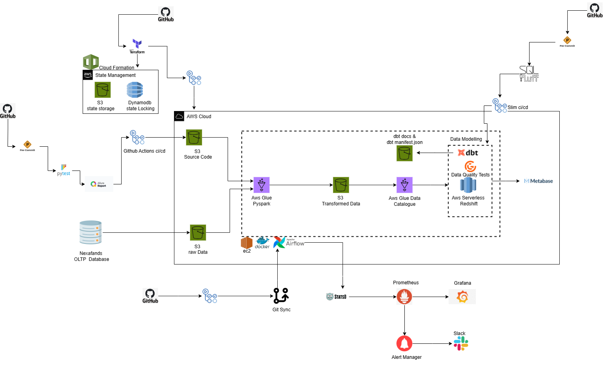
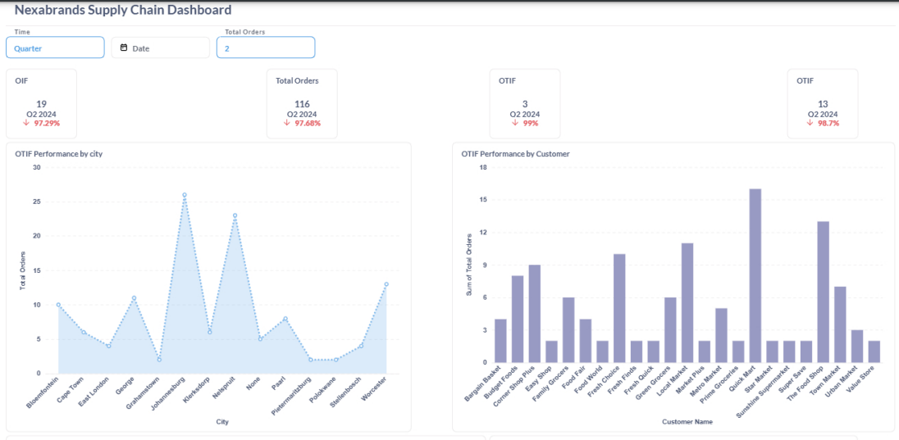
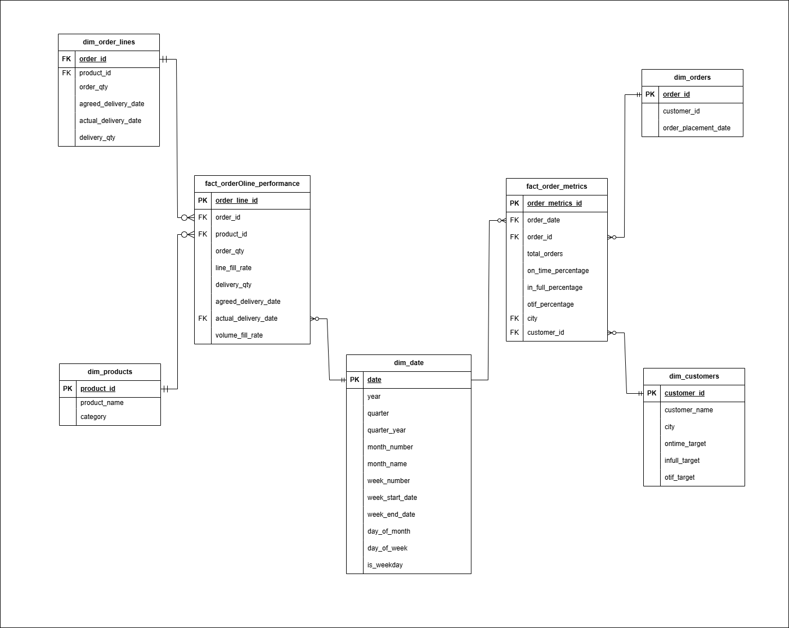

## Nexabrands Supply Chain Pipeline

  

## Project Background

Nexabrands is a fast‑growing FMCG manufacturer headquartered in Midrand, South Africa (operational in Midrand, Nelspruit), founded in 2022 and planning expansion into additional cities over the next two years.

Several of Nexabrands’ key customers declined to renew their annual contracts, citing recurring service issues specifically, late deliveries and incomplete orders—that eroded trust and threatened future growth.

**Stakeholder Objectives**

* Monitor **On Time (OT)**, **In Full (IF)** and combined **OTIF %** for every order, updated each day.
  
* Break down OT, IF and OTIF % by city and by customer, each compared against predefined targets.
  
* Incorporate Line Fill Rate (LFR) and Volume Fill Rate (VFR) alongside OT/IF/OTIF.

## Technologies Used

                         

## Architecture Diagram

## Executive Summary
Nexabrands’ new Supply Chain dashboard delivers a clear, up‑to‑date view of our delivery performance, helping us stay on top of customer service as we grow. At the same time, the dashboard highlights a handful of cities and clients where we’ve seen occasional late or incomplete shipments. By showing exactly where and when these hiccups occur, the tool gives our operations and customer‑success teams the insight they need to jump on issues before they escalate.

**Key Insights**
1.  Through Q1–Q2 2024, Nexabrands processed 3,600 orders—a 28.5% decline versus last year. Of these, only 836 arrived on time (–16.4%) and 522 arrived in full (–25.4%), resulting in a mere 171 truly “OTIF” shipments (–43%). While the overall slowdown partly reflects seasonal demand shifts, the steep drop in service levels requires immediate attention before we expand into new markets.
  
2.  Johannesburg and Nelspruit lead the pack with 26–27 flawless deliveries each, yet smaller hubs like Pietermaritzburg and Grahamstown report fewer than five OTIF orders ,highlighting uneven supply‑chain reliability.
3. Supermarket, Town & Co and Prime Grocers remain our best partners, but accounts such as Bargain Basket and Family Foods have very low OTIF counts and risk non‑renewal if performance doesn’t improve. 

## Data Warehouse Overview

The analytics schema in Redshift employs a star‑schema  centered on two fact tables that capture both granular line‑level delivery performance (fill‑rates, volumes, actual vs. agreed dates) and higher‑level order‑metrics (OTIF, on‑time, in‑full percentages) and surrounded by four conformed dimensions (orders, customers, products and dates). This design lets you slice & dice daily service outcomes across the `who` (customer and city), `what` (product and category), `when` (order, agreed‑delivery and actual‑delivery dates) and `where` (customer geography), all in sub‑second, ad‑hoc queries.

## Technology Choices

**1. CloudFormation ,Dynamodb,s3 bucket**

* To initialize Terraform’s remote state backend without pre‑existing infrastructure,AWS CloudFormation was used to provision an S3 bucket and a DynamoDB table. CloudFormation guarantees idempotent, versioned creation of these resources and avoids the chicken‑and‑egg problem of Terraform needing its own backend before it can run.

**2. Infrastructure as Code (IaC) with Terraform**

  * Terraform  was used  to ensure all AWS resources could be provisioned, modified, and destroyed through code. 
  * This approach offers three major benefits for managing infrastructure. First,  the infrastructure can be recreated exactly as defined in code, ensuring consistency across different environments. Second,  all changes can  be tracked using Git, making it easy to review, revert, or collaborate on updates. Lastly,it enables the deployment of resources through CI/CD pipelines, reducing manual work and minimizing the risk of errors. Altogether, these benefits make the infrastructure more reliable and easier to manage.

**3. Security & Policy Management**

**GitHub Actions via OIDC**

  * AWS IAM OIDC  federation  was used to allow GitHub Actions to assume roles without long‑lived credentials, reducing secret management overhead and improving security posture.

**Policy Enforcement with Open Policy Agent**

* Infrastructure-as-code compliance and cost guardrails are enforced via OPA policies written in Rego. In the GitHub Actions workflow, OPA evaluates the Terraform plan JSON and blocks any pull requests that violate defined constraints, ensuring that unauthorized or cost‑prohibitive changes never reach our AWS environment.
  

In the example above, Infracost reports a monthly cost increase of 883USD  for the proposed changes and flags a cost policy violation because the defined threshold is 140USD. 

The GitHub Actions workflow then:

* Posts an Infracost comment on the pull request, detailing baseline vs. usage costs and total difference.

* Marks the cost policy as failed when the change exceeds the budget limit, causing the CI run to fail.

* Automatically updates the comment when code changes to reflect the latest estimates.

Triggers Slack notifications to alert the operations team immediately, ensuring visibility and enabling rapid discussion around cost remediation.

**4.Drift Detection**

* To ensure the deployed infrastructure remains consistent with the declared Terraform configurations, an automated drift detection job in GitHub Actions  is implemented. This workflow runs every 45 minutes using a cron schedule.

* Over time, manual changes in the AWS console or out-of-band automation can introduce discrepancies between live infrastructure and our Terraform state.

* By scheduling regular plan-only runs,  unintended changes  can be caught before they cause failures, security gaps, or cost overruns.

* The workflow is intergrated with Slack notifications (as shown in the attached diagram) so that the operations team receives immediate alerts about any drift detected, enabling prompt action. 
  
  

**5. Data Lake & ETL**

**Multi‑Bucket S3 Data Lake**
* Raw Data Bucket: Immutable ingestion layer.

* Code Bucket: Stores AWS Glue PySpark scripts and dependencies.

* Transformed Data Bucket: Hosts cleansed, enriched datasets.

This separation enforces clear data ownership, enables lifecycle management (e.g., tiering raw data to Glacier), and prepares data for scalable ETL via AWS Glue 

**6. AWS Glue PySpark**
* Although our personal project size didn’t mandate Glue, integrating AWS Glue PySpark showcases how to scale ETL for large datasets with managed Spark clusters, built‑in schema discovery, and tight integration with the AWS ecosystem.
* In this project glue was used to transform the data in the   source  s3 bucket   to the target s3 bucket
* The folloing images shows the aws glue scripts being orchastrated by aiflow
  
  

  **If a task fails a Notification will be sent to slack**
    

**7. Data Warehousing & Modeling**

**Amazon Redshift Spectrum**

* To decouple storage costs from compute, Redshift Spectrum  was used to query data directly in S3. This leverages Redshift’s MPP compute for performance while offloading storage to cost‑effective S3.
  
**dbt on EC2**

* Open‑source dbt Core  was run  on an EC2 instance to define modular, versioned transformations in SQL. Hosting dbt on EC2 under our control keeps costs predictable, and running models via Airflow (below) ensures repeatable orchestration
 

**8. Orchestration & Scheduling**

 **Apache Airflow on EC2**
 * Airflow, deployed on EC2, provides a robust scheduler and DAG‑based orchestration for ETL and analytics tasks. Running on EC2 affords us full control over scaling, virtual networking, and dependency management
  
  **Cosmos for Selective dbt Runs**
* Astronomer Cosmos was intergrated to allow dbt to be scheduled by airflow .
* This also allows airflow  to smartly re‑execute only failed dbt tasks, reducing compute waste and accelerating iterative debugging.
*  This pattern minimizes cost by avoiding full DAG re‑runs when only a subset of models fails.

**9. CI/CD Pipelines & Quality Assurance**

**AWS Glue CI/CD**

**Pre‑commit Hooks**
- Used  flake8, black, isort ensure code quality and consistency.

**Pytest & Allure** 

Used Pytest to test the python code then Allure generates rich test coverage reports hosted on GitHub Pages.

**GitHub Actions**

 * Orchestrates the above steps, then stages scripts to S3 for Glue to pick up.

**10. Monitoring & Alerting**

 * Prometheus scrapes Airflow and EC2 metrics, with Grafana dashboards visualizing system health. Alertmanager routes critical alerts (e.g., DAG failures) to Slack channels, enabling rapid incident response.
  
  **Airflow dag Dashboard**
  

  **Airflow cluster dashboard**

  

  **Operational management**

   
  
  **Slack Notifications**

  

